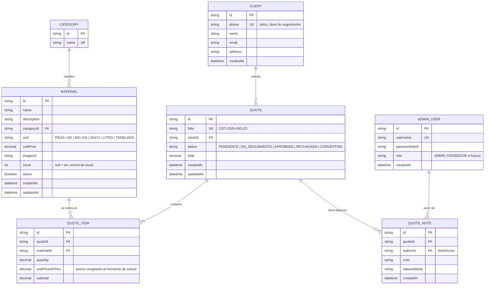

# Diagrama entidad-relación — CotiMat

## Notas de modelado

- **`unitPriceAtTime` en `QUOTE_ITEM`**: el precio del material se congela al momento de
  crear la cotización. Si el admin cambia `Material.unitPrice` después, las cotizaciones
  ya emitidas no cambian — es lo que el cliente vio y aceptó.
- **`QUOTE_NOTE` como bitácora append-only** en vez de un campo `notes` único: cada
  cambio de estatus o comentario de seguimiento queda como un registro nuevo, con quién
  lo hizo y cuándo. Esto cubre a la vez "notas internas de seguimiento" e "historial de
  contacto con el cliente" del prompt original sin duplicar tablas.
- **`Material.stock` nullable**: `null` significa "no se controla inventario para este
  material" (comportamiento por defecto del MVP). Un número activa control de
  disponibilidad a futuro sin migración adicional.
- **`Client` no tiene password**: el teléfono es la llave de identificación pública
  (ver decisión de no incluir OTP en el MVP, documentada en `docs/ARCHITECTURE.md`).
