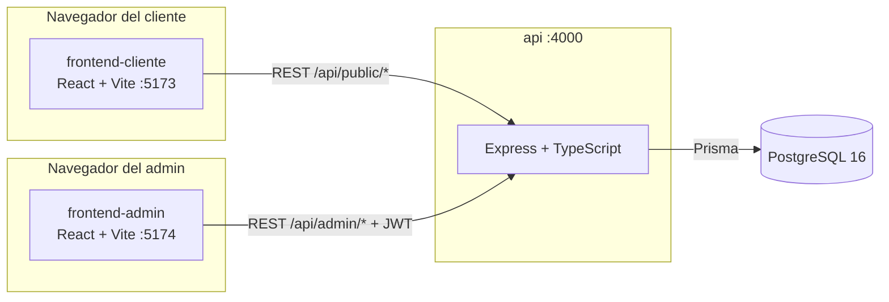

# Arquitectura — CotiMat

## Visión general

CotiMat son **cuatro procesos independientes** que solo se comunican por HTTP. Ningún
frontend tiene credenciales de base de datos ni conocimiento de Prisma: todo pasa por
`api/`.



Cada capa se construye, versiona y despliega por separado (ver `Dockerfile` en `api/` y
en cada app de `frontend/apps/`). `docker-compose.yml` en la raíz los orquesta para
desarrollo local; nada impide desplegar cada uno en un servicio distinto en producción
(dos contenedores estáticos + un servicio Node + un Postgres administrado).

## Por qué este stack

| Capa | Elección | Motivo |
|---|---|---|
| API | Node + Express + TypeScript | Ecosistema maduro, curva de entrada baja, tipado estricto sin la sobrecarga de un framework más opinionado (Nest) para este alcance de MVP. |
| ORM/BD | Prisma + PostgreSQL 16 | Migraciones versionadas, tipos generados desde el esquema (cero desincronización entre BD y TS), y PostgreSQL cubre bien las relaciones cliente/material/cotización descritas en el dominio. |
| Frontends | React + Vite + TypeScript + Tailwind | Recarga instantánea en desarrollo, tipado compartido con el contrato de la API, Tailwind permite implementar un sistema de diseño propio (ver abajo) sin pelear contra los defaults de una librería de componentes. |
| Datos remotos | TanStack Query | Cache, invalidación y estados de carga/error sin escribir un store manual para cada endpoint. |
| Estado local | Zustand | Carrito de cotización (cliente) y sesión JWT (admin) son estados pequeños y locales; no justifican Redux. |

## Estructura de carpetas

```
CotiMat/
├── database/     → documentación de referencia del modelo (Prisma es la fuente de verdad)
├── api/          → backend Express + Prisma
├── frontend/
│   ├── apps/cliente/   → app pública (catálogo, carrito, cotización, historial)
│   └── apps/admin/     → panel interno (catálogo, cotizaciones, seguimiento)
├── docs/         → este documento
└── docker-compose.yml
```

`frontend/` es un workspace npm (`apps/*`) solo para compartir tooling de instalación;
`cliente` y `admin` son proyectos Vite completamente independientes entre sí — ninguno
importa código del otro, cada uno tiene su propio `Dockerfile` y se construye por
separado, cumpliendo el requisito de separación estricta entre el frontend público y el
panel administrativo.

## Autenticación

- **Admin**: usuario/contraseña → JWT (bearer, ~8h de expiración, `bcryptjs` para el
  hash). Un solo rol (`ADMIN`) en el MVP; el modelo ya tiene la columna `role` lista
  para un segundo rol (`VENDEDOR`, ver roadmap) sin migración adicional.
- **Cliente**: sin contraseña. El teléfono es la llave de identificación pública — se
  manda en cada request que necesita "ser dueño" del dato (crear cotización, ver
  historial). No hay sesión persistente ni verificación OTP en este MVP (ver roadmap).

## Seguridad transversal

- `helmet` (cabeceras), `cors` con allowlist de orígenes por variable de entorno,
  `express-rate-limit` en rutas públicas (más estricto en login y en creación de
  cotizaciones) para mitigar abuso/fuerza bruta.
- Toda entrada se valida con `zod` antes de tocar la base de datos
  (`middlewares/validate.middleware.ts`).
- Prisma parametriza automáticamente todas las queries — no hay SQL concatenado en
  ningún módulo, por lo que no hay superficie de inyección SQL.
- Los precios de cada línea de cotización se congelan (`unitPriceAtTime`) al momento de
  crearla: un cambio posterior de precio en el catálogo nunca altera una cotización ya
  emitida.
- Prisma serializa sus campos `Decimal` (precios, cantidades, totales) como *string* en
  JSON por defecto; `middlewares/serializeDecimals.middleware.ts` los convierte a
  `number` de forma centralizada para que el contrato de la API sea consistente en
  ambos frontends.

## Esquema de puertos

Los puertos por defecto de `docker-compose.yml` (`5433` BD, `4010` API, `5183`
cliente, `5184` admin) se eligieron para no chocar con los puertos "de fábrica"
(`5432`/`4000`/`5173`) que suele ocupar cualquier otro proyecto corriendo en la misma
máquina. Son variables de entorno (`DB_PORT`, `API_PORT`, `CLIENTE_PORT`,
`ADMIN_PORT`, ver `.env.example` en la raíz) — ajústalas libremente si tienes otro
conflicto local. Al correr cada pieza de forma nativa (sin Docker) para desarrollo
rápido, cada proyecto usa sus puertos por defecto estándar (`4000`, `5173`, `5174`,
`5432`) definidos en sus propios `.env.example`.

## Roadmap / decisiones diferidas conscientemente

Estas quedaron fuera del alcance del MVP por decisión explícita (ver
`AskUserQuestion` del diseño original) para no depender de credenciales de terceros
que el equipo aún no tiene, pero el código está estructurado para no requerir un
rediseño al agregarlas:

- **Verificación OTP del teléfono** (SMS/WhatsApp): el cliente se identifica solo por
  teléfono. Cuando se quiera agregar, es un paso previo a `registerOrUpdateClient` en
  `api/src/modules/clients/clients.service.ts` — no toca el resto del dominio.
- **Notificaciones reales** (email/WhatsApp al cliente, alerta al admin): hoy
  `api/src/services/notification.service.ts` solo registra en consola detrás de la
  interfaz `NotificationService`. Implementar una clase nueva (ej. `TwilioNotificationService`,
  `SmtpNotificationService`) y cambiar la instancia exportada es todo el cambio
  necesario.
- **Almacenamiento de imágenes en S3**: hoy `api/src/modules/uploads/storage.service.ts`
  guarda en disco local (volumen Docker) detrás de la interfaz `StorageService`. Migrar
  a S3 es una nueva implementación de esa interfaz.
- **Rol "vendedor/seguimiento"** con permisos reducidos: el enum `AdminRole` en
  `schema.prisma` ya reserva el espacio; falta añadir el valor `VENDEDOR` y una
  verificación de rol en `auth.middleware.ts`.
- **Reportes** (materiales más cotizados, cotizaciones por periodo, tasa de
  conversión): consultas de agregación nuevas sobre `Quote`/`QuoteItem`, sin cambios de
  esquema.
- **Control de stock activo** (reservar/descontar al convertir una cotización en
  venta): el campo `Material.stock` ya existe pero hoy es solo informativo.
- **Build de producción de los frontends**: los `Dockerfile` actuales corren
  `vite dev` con volúmenes montados (pensados para desarrollo, como pide el enunciado).
  Para producción, el paso natural es un Dockerfile multi-stage (`npm run build` →
  servir `dist/` con `nginx`), sin cambios en el código de la app.
- **Refresh tokens** para la sesión de admin: hoy es un JWT de una sola vida (~8h); un
  esquema de refresh token es una mejora incremental sobre `modules/auth`.
